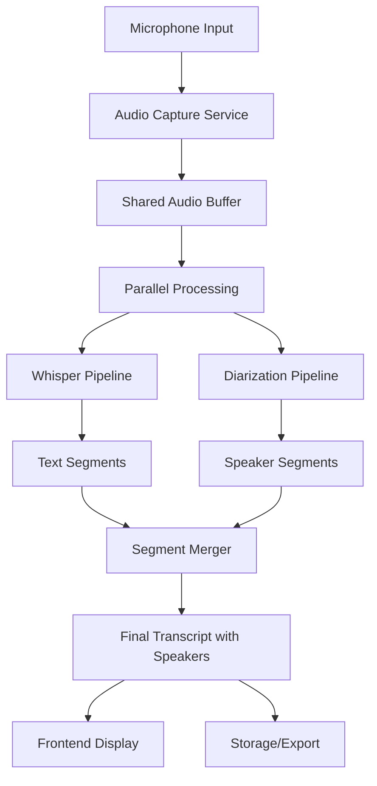

# Speaker Diarization Data Flow

## Overview
This document details the complete data flow for speaker diarization, from audio input through speaker identification to final transcription output with speaker labels.

## High-Level Data Flow



## Detailed Component Data Flows

### 1. Audio Input Pipeline

```
Microphone (48kHz) → Resampler → 16kHz Mono → Ring Buffer
                                                    ↓
                                            Shared Access Point
                                            ↙               ↘
                                    Whisper              Diarization
```

**Data Transformations**:
1. **Input**: Raw PCM audio at device sample rate (e.g., 48kHz)
2. **Resampling**: Convert to 16kHz mono (Whisper/Diarization requirement)
3. **Buffering**: Store in lock-free ring buffer
4. **Output**: Float32 samples accessible to multiple consumers

**Buffer Management**:
```rust
// Ring buffer with multiple read pointers
struct SharedBuffer {
    data: Vec<f32>,           // Circular buffer
    capacity: usize,          // Total size
    write_pos: AtomicUsize,   // Write position
    readers: HashMap<String, AtomicUsize>, // Read positions per consumer
}
```

### 2. Parallel Processing Architecture

Both pipelines process the same audio simultaneously:

```
Time →  [0s]    [1.5s]   [3s]    [4.5s]   [6s]
Audio:  ████████████████████████████████████
        ↓        ↓        ↓        ↓        ↓
Whisper: └──1.5s─┘└──1.5s─┘└──1.5s─┘
Diariz:  └───3s───┘  └───3s───┘  └───3s───┘
```

**Whisper Pipeline** (1.5s chunks):
- Minimum buffer: 1.5 seconds
- Process: VAD → Transcription → Text segments
- Output: `{text, start_time, end_time, confidence}`

**Diarization Pipeline** (3s windows):
- Sliding window: 3 seconds with 1.5s overlap
- Process: VAD → Embedding → Clustering → Speaker ID
- Output: `{speaker_id, start_time, end_time, confidence}`

### 3. Voice Activity Detection (VAD)

Shared VAD results to avoid duplicate processing:

```
Audio Chunk → VAD Processor → Speech/Silence Decision
                    ↓
            VAD Result Cache
                ↙        ↘
        Whisper         Diarization
```

**VAD Output**:
```typescript
interface VADResult {
  startTime: number;
  endTime: number;
  isSpeech: boolean;
  energy: number;
  confidence: number;
}
```

### 4. Speaker Embedding Extraction

```
Speech Segment → Embedding Model → 512-dim vector
                        ↓
                Embedding Cache
                        ↓
                Clustering Algorithm
                        ↓
                   Speaker ID
```

**Embedding Pipeline**:
1. **Input**: 3-second speech segment (48,000 samples at 16kHz)
2. **Model**: pyannote-rs embedding extractor
3. **Output**: 512-dimensional speaker embedding
4. **Cache**: Store recent embeddings for comparison

**Embedding Data Structure**:
```rust
struct EmbeddingCache {
    embeddings: VecDeque<(SpeakerEmbedding, TimeRange)>,
    max_size: usize,  // Limit memory usage
    similarity_threshold: f32,
}
```

### 5. Speaker Clustering

Online clustering for real-time speaker identification:

```
New Embedding → Compare with Existing Clusters
                        ↓
              Similarity > Threshold?
                   ↙          ↘
                Yes            No
                 ↓              ↓
        Assign to Cluster   Create New Cluster
                 ↓              ↓
            Update Profile  Initialize Profile
```

**Clustering Algorithm**:
```python
# Pseudo-code for online clustering
def assign_speaker(embedding, clusters, threshold=0.7):
    max_similarity = 0
    best_cluster = None
    
    for cluster in clusters:
        similarity = cosine_similarity(embedding, cluster.centroid)
        if similarity > max_similarity:
            max_similarity = similarity
            best_cluster = cluster
    
    if max_similarity > threshold:
        best_cluster.add(embedding)
        return best_cluster.id
    else:
        new_cluster = create_cluster(embedding)
        return new_cluster.id
```

### 6. Segment Alignment & Merging

Combine transcription and speaker identification:

```
Whisper Output:     |--"Hello"--|--"World"--|
Timeline:           0s    2s    3s    5s    6s
Diarization Output: |--Speaker1--|--Speaker2--|
                           ↓
                    Alignment Algorithm
                           ↓
Final Output:       |"Hello"-S1-|"World"-S2-|
```

**Alignment Strategy**:
1. **Temporal Overlap**: Match segments by time overlap
2. **Confidence Weighting**: Prefer higher confidence assignments
3. **Conflict Resolution**: Handle overlapping speakers
4. **Gap Filling**: Interpolate speaker for small gaps

**Merge Algorithm**:
```typescript
function mergeSegments(
  transcription: TranscriptSegment[],
  speakers: SpeakerSegment[]
): FinalSegment[] {
  const merged = [];
  
  for (const trans of transcription) {
    // Find overlapping speaker segments
    const overlaps = speakers.filter(s => 
      s.startTime < trans.endTime && 
      s.endTime > trans.startTime
    );
    
    if (overlaps.length === 1) {
      // Simple case: one speaker
      merged.push({
        ...trans,
        speakerId: overlaps[0].speakerId,
        speakerConfidence: overlaps[0].confidence
      });
    } else if (overlaps.length > 1) {
      // Multiple speakers: split or choose highest confidence
      const best = overlaps.reduce((a, b) => 
        a.confidence > b.confidence ? a : b
      );
      merged.push({
        ...trans,
        speakerId: best.speakerId,
        speakerConfidence: best.confidence,
        hasOverlap: true
      });
    }
  }
  
  return merged;
}
```

### 7. Real-time Event Flow

Events emitted during processing:

```
Audio Processing → Event Emission → Frontend Updates
        ↓                ↓                ↓
  [Backend]         [Tauri IPC]      [React State]
```

**Event Sequence**:
1. `diarization-ready`: Model loaded, ready to process
2. `speaker-detected`: New speaker identified
3. `speaker-activity`: Speaker starts/stops speaking
4. `transcription-update`: Text with speaker ID
5. `diarization-progress`: Processing status
6. `diarization-complete`: Final results ready

**Event Batching**:
```typescript
// Batch updates to prevent UI flooding
class EventBatcher {
  private queue: DiarizationEvent[] = [];
  private timer: NodeJS.Timeout | null = null;
  
  add(event: DiarizationEvent) {
    this.queue.push(event);
    if (!this.timer) {
      this.timer = setTimeout(() => this.flush(), 100);
    }
  }
  
  flush() {
    if (this.queue.length > 0) {
      emit('batch-update', this.queue);
      this.queue = [];
    }
    this.timer = null;
  }
}
```

### 8. Frontend State Management

React state updates from events:

```
Tauri Event → Event Handler → State Reducer → UI Update
                    ↓              ↓              ↓
              Validation      State Update   Re-render
```

**State Management**:
```typescript
// Redux-style reducer for speaker state
function speakerReducer(state: SpeakerState, action: Action) {
  switch (action.type) {
    case 'SPEAKER_DETECTED':
      return {
        ...state,
        speakers: new Map([
          ...state.speakers,
          [action.payload.speakerId, createSpeakerProfile(action.payload)]
        ])
      };
    
    case 'SPEAKER_ACTIVITY':
      const speaker = state.speakers.get(action.payload.speakerId);
      if (speaker) {
        speaker.isActive = action.payload.isActive;
        speaker.lastActive = Date.now();
      }
      return { ...state };
    
    case 'SEGMENT_ADDED':
      return {
        ...state,
        segments: [...state.segments, action.payload]
      };
  }
}
```

### 9. Buffer Synchronization

Ensuring consistent data between pipelines:

```
Write Position: 48000 samples
                    ↓
Whisper Read:   45000 (3000 behind)
Diarization Read: 42000 (6000 behind)
                    ↓
        Buffer Management Logic:
        - Prevent overflow (wrap around)
        - Track consumer lag
        - Alert if falling behind
```

**Synchronization Points**:
1. **Timestamp Alignment**: Use absolute timestamps
2. **Buffer Pressure**: Monitor lag between consumers
3. **Backpressure**: Slow down if consumer falls behind
4. **Recovery**: Skip ahead if too far behind

### 10. Memory Management

Efficient memory usage for long sessions:

```
Active Memory (last 5 minutes):
├── Audio Buffer: 4.8MB (16kHz × 1ch × 4bytes × 300s)
├── Embeddings: 2MB (512 × 4bytes × 1000 embeddings)
├── Segments: 1MB (structured data)
└── Cache: 2MB (VAD results, similarities)

Archived Memory (compressed):
├── Older Embeddings: PCA reduced to 128 dims
├── Segment Summaries: Text only, no audio
└── Statistics: Aggregated metrics
```

**Memory Optimization**:
```rust
impl MemoryManager {
    fn compress_old_data(&mut self, age_threshold: Duration) {
        // Reduce embedding dimensions for old data
        for embedding in self.embeddings.iter_mut() {
            if embedding.age() > age_threshold {
                embedding.compress_pca(128); // 512 → 128 dims
            }
        }
        
        // Clear audio buffers for processed segments
        self.audio_buffer.clear_processed();
        
        // Aggregate statistics instead of raw data
        self.statistics.aggregate_old_segments();
    }
}
```

## Performance Considerations

### Bottleneck Analysis

| Component | Latency | Throughput | CPU Usage |
|-----------|---------|------------|-----------|
| Audio Capture | <10ms | 16kHz continuous | 1% |
| Resampling | <5ms | 100x realtime | 2% |
| VAD | <10ms | 50x realtime | 1% |
| Embedding | <50ms | 10x realtime | 5% |
| Clustering | <20ms | 20x realtime | 2% |
| Merging | <10ms | 100x realtime | 1% |

### Optimization Strategies

1. **Batch Processing**: Process multiple chunks together
2. **Caching**: Cache VAD results and embeddings
3. **Lazy Evaluation**: Only process when needed
4. **Hardware Acceleration**: Use Metal/CUDA when available
5. **Memory Pooling**: Reuse buffers to reduce allocations

## Error Recovery

### Failure Modes and Recovery

```
Error Detection → Graceful Degradation → User Notification
        ↓               ↓                    ↓
   Log & Metrics   Fallback Mode      Status Update
```

**Recovery Strategies**:

1. **Model Load Failure**:
   - Continue with transcription only
   - Retry loading in background
   - Notify user of limited functionality

2. **Memory Exhaustion**:
   - Compress old data
   - Clear caches
   - Reduce quality if needed

3. **Processing Timeout**:
   - Skip problematic segment
   - Process smaller chunks
   - Fall back to simpler algorithm

4. **Speaker Confusion**:
   - Increase clustering threshold
   - Request user confirmation
   - Mark low-confidence segments

## Testing Data Flow

### Unit Test Points

1. **Buffer Tests**: Concurrent read/write
2. **VAD Tests**: Speech/silence detection
3. **Embedding Tests**: Vector similarity
4. **Clustering Tests**: Speaker separation
5. **Merger Tests**: Alignment accuracy

### Integration Test Scenarios

1. **2-Speaker Conversation**: Simple back-and-forth
2. **Multi-Speaker Meeting**: 4+ speakers
3. **Overlapping Speech**: Simultaneous speakers
4. **Long Session**: 1+ hour recording
5. **Noisy Environment**: Background noise

### Performance Benchmarks

```typescript
// Benchmark test structure
interface PerformanceBenchmark {
  scenario: string;
  audioLength: number; // seconds
  speakerCount: number;
  expectedMetrics: {
    processingTime: number; // ms
    accuracy: number; // 0-1
    memoryUsage: number; // MB
    cpuUsage: number; // percentage
  };
}
```

## Monitoring & Diagnostics

### Key Metrics to Track

```typescript
interface DiarizationMetrics {
  // Performance
  audioProcessed: number; // seconds
  processingLatency: number; // ms
  realTimeFactor: number;
  
  // Quality
  speakersDetected: number;
  averageConfidence: number;
  segmentCount: number;
  
  // Resources
  memoryUsage: number; // MB
  cpuUsage: number; // percent
  cacheHitRate: number;
  
  // Errors
  errorsCount: number;
  recoveriesCount: number;
  warningsCount: number;
}
```

### Debug Logging

```rust
// Strategic logging points
tracing::debug!("Audio buffer: write_pos={}, readers={:?}", write_pos, readers);
tracing::debug!("Embedding extracted: quality={}, time={}ms", quality, elapsed);
tracing::debug!("Speaker assigned: id={}, confidence={}", speaker_id, confidence);
tracing::debug!("Segments merged: input={}, output={}", input_count, output_count);
```

## Future Enhancements

1. **Adaptive Processing**: Adjust parameters based on performance
2. **Predictive Clustering**: Anticipate speaker changes
3. **Cross-Session Learning**: Recognize speakers across meetings
4. **Emotion Detection**: Add emotional state to speaker profiles
5. **Language-Aware Diarization**: Optimize for specific languages