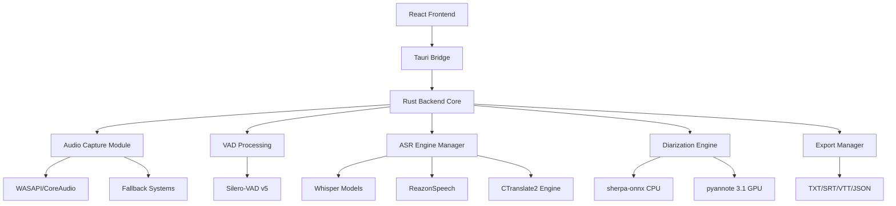
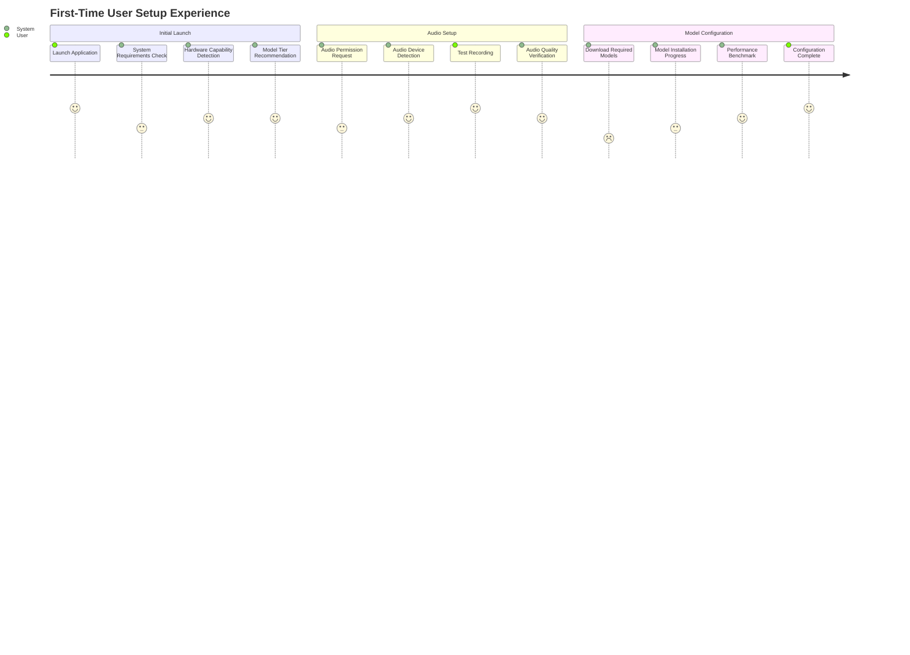
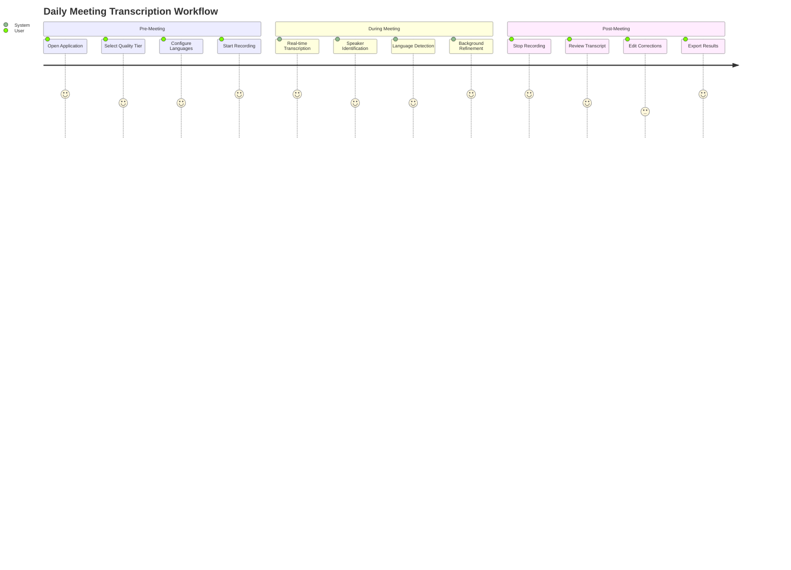
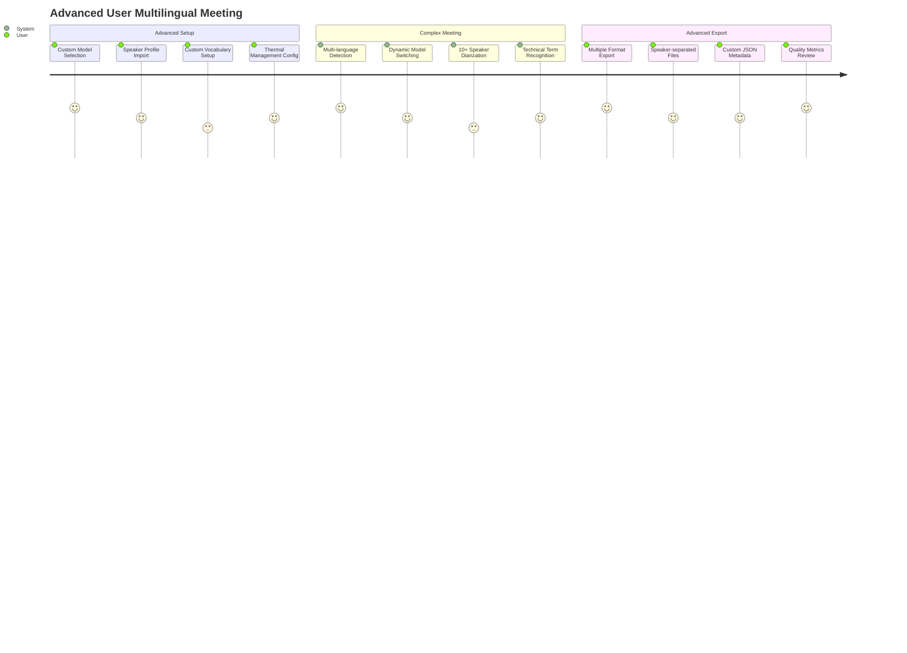

# INITIAL Requirements Document: KagiNote Privacy-First Transcription System

**Project:** KagiNote - Privacy-Focused Meeting Transcription Application  
**Document Version:** 1.0  
**Date:** January 19, 2025  
**Type:** Comprehensive Requirements & Test Specifications for TDD Development  

---

## 1. Executive Summary

KagiNote is a privacy-first, multilingual meeting transcription application that runs entirely on users' local machines. Built with Tauri v2, React 19, and Rust, it provides real-time transcription with speaker diarization for Windows and macOS platforms. The system supports 100+ languages with optimized performance for English and Japanese, featuring tiered quality modes to match hardware capabilities. All processing occurs locally with no cloud dependencies, ensuring complete user privacy and data sovereignty.

---

## 2. Business Context

### 2.1 Problem Statement
- Existing transcription services require cloud processing, creating privacy concerns for sensitive business meetings
- Current solutions lack robust multilingual support, especially for English-Japanese mixed meetings
- Users need real-time transcription with speaker identification without compromising data privacy
- Hardware resource management for AI models is poorly handled in existing solutions

### 2.2 Value Proposition
- **Complete Privacy**: Zero data leaves the device, ensuring confidential meeting security
- **Multilingual Excellence**: Optimized support for 100+ languages with specialized EN/JP handling
- **Hardware Adaptive**: Automatic quality/performance optimization based on system capabilities
- **Real-time Processing**: Sub-2-second latency transcription with background refinement

### 2.3 Success Metrics & KPIs
- **Privacy Compliance**: 100% local processing with zero network calls (measurable via network monitoring)
- **Transcription Accuracy**: <10% Word Error Rate (WER) for English, <8% Character Error Rate (CER) for Japanese
- **Performance**: Real-Time Factor (RTF) <1.0 on minimum hardware specifications
- **User Adoption**: Support minimum hardware (6-core CPU, 8GB RAM) for 80% of target users
- **System Reliability**: Zero crashes during 4-hour continuous operation sessions

---

## 3. User Personas

### 3.1 Primary Persona: Business Professional
- **Role**: Meeting facilitator, project manager, consultant
- **Goals**: Accurate meeting minutes without manual note-taking, speaker attribution
- **Pain Points**: Privacy concerns with cloud services, mixed-language meetings
- **Technical Level**: Moderate - comfortable with desktop applications
- **Usage Pattern**: 2-4 meetings/day, 30-90 minutes each
- **Hardware**: Modern laptop with 16GB RAM, may have dedicated GPU

### 3.2 Secondary Persona: Executive Assistant
- **Role**: Administrative support, meeting coordination
- **Goals**: Generate clean transcripts for distribution, maintain confidentiality
- **Pain Points**: Time-consuming manual transcription, accuracy requirements
- **Technical Level**: Basic - needs simple, reliable operation
- **Usage Pattern**: Daily transcription tasks, batch processing
- **Hardware**: Standard business laptop, CPU-only systems

### 3.3 Tertiary Persona: International Business User
- **Role**: Global team coordinator, multilingual meeting facilitator
- **Goals**: Support English-Japanese mixed meetings, cultural context preservation
- **Pain Points**: Language switching during meetings, speaker identification in multilingual contexts
- **Technical Level**: Advanced - willing to configure language-specific settings
- **Usage Pattern**: Multilingual meetings, needs custom vocabulary support
- **Hardware**: High-performance workstation with GPU acceleration

---

## 4. Functional Requirements with Test Scenarios

### 4.1 Audio Capture System

#### FR-001: Multi-Platform Audio Capture
**Requirement**: Capture system audio and microphone input on Windows and macOS with automatic fallback mechanisms.

**User Story**: As a meeting participant, I want the system to automatically capture all meeting audio from any conferencing platform so that I don't miss any content.

**Test Scenarios**:
- **Happy Path**: 
  - GIVEN Windows system with WASAPI available
  - WHEN user starts transcription
  - THEN system captures both system audio and microphone with <50ms latency
  
- **Fallback Scenario**:
  - GIVEN WASAPI blocked by enterprise policy
  - WHEN primary capture fails
  - THEN system automatically switches to WDM/virtual audio cable with user notification

- **macOS Scenario**:
  - GIVEN macOS system without BlackHole installed
  - WHEN user starts transcription
  - THEN system guides user through BlackHole installation OR offers browser extension alternative

**Acceptance Criteria**:
- [ ] Audio capture latency <50ms
- [ ] Automatic channel separation for "You" vs "Others"
- [ ] Fallback mechanism succeeds within 5 seconds
- [ ] Clear user notifications for any setup requirements

**Performance Targets**:
- Sample rate: 16kHz (Whisper requirement)
- Bit depth: 16-bit minimum
- Channel support: Stereo capture, mono downmix for processing

#### FR-002: Audio Preprocessing Pipeline
**Requirement**: Process captured audio for optimal transcription quality while preserving original for playback.

**Test Scenarios**:
- **Audio Quality Test**:
  - GIVEN noisy conference call audio
  - WHEN preprocessing applied
  - THEN noise reduction improves SNR by >10dB without speech distortion
  
- **Format Standardization**:
  - GIVEN 44.1kHz stereo input
  - WHEN preprocessing pipeline processes audio
  - THEN output is 16kHz mono with preserved speech clarity

**Acceptance Criteria**:
- [ ] Automatic gain control (AGC) within ±3dB
- [ ] Noise suppression without speech artifacts
- [ ] Format conversion with <1% quality loss
- [ ] Real-time processing with <10ms additional latency

### 4.2 Voice Activity Detection (VAD)

#### FR-003: Intelligent Speech Detection
**Requirement**: Use Silero-VAD v5 to detect speech segments and prevent transcription of silence/noise.

**Test Scenarios**:
- **Speech Detection Accuracy**:
  - GIVEN audio with 60% speech, 40% silence
  - WHEN VAD processes audio stream
  - THEN speech detection accuracy >95% with <5% false positives

- **Dynamic Threshold Adaptation**:
  - GIVEN varying background noise levels
  - WHEN noise increases during meeting
  - THEN VAD threshold adapts within 2 seconds without losing speech

**Acceptance Criteria**:
- [ ] Speech threshold: 0.5 probability (configurable)
- [ ] Min speech duration: 0.5 seconds
- [ ] Max speech duration: 30 seconds (auto-split)
- [ ] Context padding: 400ms before/after speech
- [ ] CPU usage <1% on target hardware

**Test Data Requirements**:
```python
# VAD Test Factory
vad_test_scenarios = {
    "quiet_office": {"noise_level": -40dB, "speech_ratio": 0.7},
    "noisy_cafe": {"noise_level": -20dB, "speech_ratio": 0.5},
    "conference_room": {"noise_level": -30dB, "speech_ratio": 0.8},
    "phone_call": {"noise_level": -25dB, "speech_ratio": 0.6}
}
```

### 4.3 Automatic Speech Recognition (ASR)

#### FR-004: Tiered Quality Selection
**Requirement**: Provide user-selectable quality tiers that automatically optimize for hardware capabilities.

**User Story**: As a user with limited hardware, I want the system to automatically select the best possible quality tier that runs smoothly on my machine.

**Test Scenarios**:
- **Standard Tier Performance**:
  - GIVEN 8-core CPU with 16GB RAM
  - WHEN using Whisper Medium (INT8)
  - THEN RTF ≤0.8 with WER ≤12% for English

- **High Accuracy Tier**:
  - GIVEN GPU system with 6GB VRAM
  - WHEN using Whisper Large-v3-Turbo
  - THEN RTF ≤0.3 with WER ≤8% for English

- **Auto-Configuration**:
  - GIVEN system with 4GB free RAM
  - WHEN app starts
  - THEN automatically selects appropriate model with user confirmation

**Quality Tier Specifications**:
| Tier | Model | Target RTF | Min Hardware | Expected WER |
|------|-------|------------|--------------|---------------|
| Standard | Whisper Medium INT8 | ≤1.0 | 6-core CPU, 8GB RAM | ≤12% EN |
| High Accuracy | Whisper Large-v3 | ≤2.0 | 8-core CPU, 16GB RAM | ≤8% EN |
| Turbo | Large-v3-Turbo | ≤0.8 | 4GB VRAM GPU | ≤10% EN |

#### FR-005: Multilingual Support with Language Detection
**Requirement**: Automatically detect languages and route to optimized models, supporting 100+ languages with EN/JP optimization.

**Test Scenarios**:
- **Language Detection Accuracy**:
  - GIVEN 5-second audio samples in EN, JP, ES, FR, DE
  - WHEN language detection runs
  - THEN accuracy >90% with confidence scores >0.8

- **Language Switching**:
  - GIVEN meeting switching between English and Japanese
  - WHEN speakers change languages mid-sentence
  - THEN system adapts within 3 seconds without losing context

- **Japanese Optimization**:
  - GIVEN CPU-only system processing Japanese audio
  - WHEN ReazonSpeech k2-v2 available
  - THEN automatically route to ReazonSpeech with 10× speed improvement

**Acceptance Criteria**:
- [ ] Support 100+ languages via Whisper models
- [ ] Language detection confidence threshold: 0.8
- [ ] ReazonSpeech integration for Japanese (CPU systems)
- [ ] English-optimized models (Base.en/Small.en) for 2× speed improvement
- [ ] Graceful fallback to multilingual models for low-confidence detection

### 4.4 Real-Time Processing Pipeline

#### FR-006: Two-Pass Transcription Architecture
**Requirement**: Implement immediate display with background refinement for optimal user experience and accuracy.

**User Story**: As a meeting participant, I want to see transcription results immediately while the system improves accuracy in the background.

**Test Scenarios**:
- **Pass 1 Latency**:
  - GIVEN continuous speech input
  - WHEN Pass 1 processing active
  - THEN first word appears within 1.5 seconds of speech start

- **Pass 2 Refinement**:
  - GIVEN completed speech segment
  - WHEN Pass 2 processes with full context
  - THEN accuracy improvement >15% over Pass 1 results

- **Context Preservation**:
  - GIVEN 10-minute conversation
  - WHEN processing overlapping segments
  - THEN context maintained across segments without duplication

**Two-Pass Architecture Specifications**:
```yaml
Pass1_RealTime:
  window_size: 10_seconds
  overlap: 2_seconds  
  context_words: 50
  target_latency: <1.5_seconds

Pass2_Refinement:
  window_size: 30_seconds
  full_context: true
  speaker_conditioning: enabled
  trigger: silence_detection OR user_pause
```

#### FR-007: Context-Aware Streaming
**Requirement**: Maintain conversation context across segments to prevent repetition and improve accuracy.

**Test Scenarios**:
- **Context Continuity**:
  - GIVEN conversation about "machine learning algorithms"
  - WHEN processing new segment mentioning "the algorithms"
  - THEN pronoun resolution maintains context from previous segments

- **Duplicate Prevention**:
  - GIVEN overlapping audio segments
  - WHEN merging transcription results
  - THEN no duplicate phrases appear in final output

**Acceptance Criteria**:
- [ ] Context buffer maintains last 100 words
- [ ] Overlap detection and removal >98% accuracy
- [ ] Context conditioning improves accuracy by >10%
- [ ] Memory usage for context <50MB

### 4.5 Speaker Diarization

#### FR-008: Multi-Mode Speaker Identification
**Requirement**: Provide speaker diarization optimized for hardware capabilities with fallback options.

**Test Scenarios**:
- **CPU Mode (sherpa-onnx)**:
  - GIVEN 2-4 speaker meeting on CPU-only system
  - WHEN diarization processing active
  - THEN speaker identification accuracy >85% with <5% CPU usage

- **GPU Mode (pyannote 3.1)**:
  - GIVEN 6+ speaker conference call with GPU available
  - WHEN using pyannote diarization
  - THEN speaker identification accuracy >90% for up to 10 speakers

- **Speaker Stability**:
  - GIVEN 30-minute conversation with consistent speakers
  - WHEN processing complete session
  - THEN speaker label consistency >95% (minimal speaker switching)

**Diarization Performance Targets**:
| Mode | Max Speakers | CPU Usage | DER Target | Hardware Requirement |
|------|--------------|-----------|------------|----------------------|
| sherpa-onnx | 4 | <5% | <15% | CPU-only |
| pyannote 3.1 | 10+ | <10% | <10% | 4GB+ VRAM |

#### FR-009: Speaker Embedding and Online Learning
**Requirement**: Build speaker profiles during meetings and maintain consistency across sessions.

**Test Scenarios**:
- **Profile Building**:
  - GIVEN new speaker joining meeting
  - WHEN speaker talks for >30 seconds
  - THEN system builds speaker profile and maintains consistency >90%

- **Cross-Session Recognition**:
  - GIVEN speaker from previous meeting
  - WHEN same person speaks in new meeting
  - THEN optional recognition with user confirmation (privacy-preserving)

**Acceptance Criteria**:
- [ ] ECAPA-TDNN embeddings for speaker characterization
- [ ] Real-time profile updates during meeting
- [ ] Median filtering prevents speaker label flipping
- [ ] Optional cross-session profiles (user consent required)

### 4.6 Language-Specific Optimizations

#### FR-010: Japanese Language Processing
**Requirement**: Provide specialized Japanese processing with ReazonSpeech integration for CPU systems.

**Test Scenarios**:
- **Japanese Accuracy**:
  - GIVEN Japanese business meeting audio
  - WHEN using ReazonSpeech k2-v2 model
  - THEN Character Error Rate (CER) ≤8% with 10× speed improvement over Whisper

- **Mixed Language Handling**:
  - GIVEN English meeting with Japanese technical terms
  - WHEN processing bilingual content
  - THEN both languages transcribed accurately without mode switching

**Acceptance Criteria**:
- [ ] ReazonSpeech k2-v2 ONNX integration
- [ ] Auto-offer for Japanese detection on CPU systems
- [ ] Graceful fallback to Whisper for mixed content
- [ ] Japanese terminology preservation in technical contexts

#### FR-011: English Optimization
**Requirement**: Use English-specific models for improved performance in English-only meetings.

**Test Scenarios**:
- **English-Only Performance**:
  - GIVEN confirmed English-only meeting
  - WHEN using Whisper Base.en or Small.en
  - THEN 2× speed improvement over multilingual models with equal accuracy

- **Accent Handling**:
  - GIVEN speakers with various English accents (US, UK, AU, IN)
  - WHEN processing with English-optimized models
  - THEN WER ≤10% across all accent types

**Acceptance Criteria**:
- [ ] Base.en and Small.en model integration
- [ ] 2× performance improvement over multilingual equivalents
- [ ] Accent robustness across major English variants
- [ ] Auto-suggestion for English-only meetings

---

## 5. Non-Functional Requirements

### 5.1 Performance Requirements

#### NFR-001: Real-Time Processing Performance
**Requirement**: Achieve real-time transcription performance on minimum hardware specifications.

**Test Criteria**:
- Real-Time Factor (RTF) ≤1.0 on minimum specification hardware
- First word latency ≤1.5 seconds from speech start
- Memory usage ≤8GB peak during operation
- CPU usage ≤75% average during active transcription

**Minimum Hardware Test Configuration**:
```yaml
CPU_Only_System:
  processor: "6-core modern CPU (Intel 10th gen / AMD Ryzen 3000+)"
  ram: "16GB total (8GB available for models)"
  storage: "8GB free for model storage"
  expected_performance: "Real-time with Whisper Medium"

GPU_Accelerated_System:
  processor: "Same as CPU-only"
  gpu: "4GB VRAM minimum (GTX 1650 equivalent)"
  cuda_version: "12.0+"
  expected_performance: "Real-time with Large-v3-Turbo"
```

#### NFR-002: Thermal Management
**Requirement**: Implement thermal monitoring and automatic performance scaling to prevent overheating.

**Test Scenarios**:
- **Thermal Throttling**:
  - GIVEN CPU temperature reaches 80°C
  - WHEN thermal monitoring detects overheating
  - THEN automatically downgrade model tier with user notification

- **Thermal Recovery**:
  - GIVEN system temperature drops below 75°C
  - WHEN thermal condition improves
  - THEN offer to restore original quality settings

**Acceptance Criteria**:
- [ ] Temperature monitoring every 5 seconds
- [ ] Automatic quality downgrade at 80°C
- [ ] Force cooldown periods at 90°C
- [ ] User notification of thermal state changes
- [ ] Automatic recovery when temperature normalizes

### 5.2 Security Requirements

#### NFR-003: Privacy-First Architecture
**Requirement**: Ensure zero network communication for transcription processing with complete local data control.

**Test Scenarios**:
- **Network Isolation Test**:
  - GIVEN active transcription session
  - WHEN network monitoring tools observe traffic
  - THEN zero transcription-related network calls detected

- **Data Encryption Test**:
  - GIVEN stored transcription files
  - WHEN examining file system
  - THEN all files encrypted with AES-256 at rest

- **Memory Protection Test**:
  - GIVEN transcription session end
  - WHEN examining system memory
  - THEN audio buffers securely wiped within 5 seconds

**Security Test Checklist**:
- [ ] Network activity monitoring shows zero AI model communication
- [ ] File system encryption verification with AES-256
- [ ] Memory dump analysis shows no persistent audio data
- [ ] Model integrity verification via checksums
- [ ] Sandboxed model execution environment

#### NFR-004: Model Security
**Requirement**: Ensure model integrity and secure execution environment for AI processing.

**Test Scenarios**:
- **Model Integrity**:
  - GIVEN model download or update
  - WHEN checksum verification runs
  - THEN reject any models with invalid checksums

- **Sandboxed Execution**:
  - GIVEN model execution environment
  - WHEN security scan performed
  - THEN models run with minimal system privileges

**Acceptance Criteria**:
- [ ] SHA-256 checksum verification for all models
- [ ] Restricted execution environment for model inference
- [ ] No auto-updates without user consent
- [ ] Encrypted local model storage

### 5.3 Scalability Requirements

#### NFR-005: Hardware Resource Management
**Requirement**: Dynamically adjust processing based on available system resources and competing applications.

**Test Scenarios**:
- **Memory Pressure Response**:
  - GIVEN system memory drops below 2GB available
  - WHEN resource monitor detects pressure
  - THEN automatically unload unused models and reduce batch size

- **CPU Contention Handling**:
  - GIVEN high CPU usage from other applications
  - WHEN CPU usage >90% for 30 seconds
  - THEN reduce processing priority and notify user

**Resource Management Thresholds**:
```yaml
Memory_Management:
  low_memory_threshold: 4GB_available
  critical_memory_threshold: 2GB_available
  model_unload_strategy: "least_recently_used"

CPU_Management:
  high_usage_threshold: 75%_average
  critical_usage_threshold: 90%_sustained_30s
  priority_reduction: true
```

### 5.4 Usability Requirements

#### NFR-006: Accessibility Compliance
**Requirement**: Support users with disabilities through screen reader compatibility and keyboard navigation.

**Test Scenarios**:
- **Screen Reader Compatibility**:
  - GIVEN user with NVDA/JAWS screen reader
  - WHEN navigating application interface
  - THEN all controls properly announced with semantic labels

- **Keyboard Navigation**:
  - GIVEN user unable to use mouse
  - WHEN navigating via keyboard only
  - THEN all functionality accessible via keyboard shortcuts

**Accessibility Test Checklist**:
- [ ] NVDA/JAWS screen reader compatibility verification
- [ ] Full keyboard navigation support
- [ ] High contrast mode support
- [ ] Text scaling up to 200% without loss of functionality
- [ ] WCAG 2.1 AA compliance verification

#### NFR-007: Cross-Platform Consistency
**Requirement**: Maintain consistent user experience across Windows and macOS platforms.

**Test Scenarios**:
- **UI Consistency**:
  - GIVEN same user workflow on Windows and macOS
  - WHEN comparing interface elements
  - THEN layout, colors, and functionality match within 5% variance

- **Performance Parity**:
  - GIVEN equivalent hardware specifications
  - WHEN running same transcription task
  - THEN performance difference <10% between platforms

**Acceptance Criteria**:
- [ ] Identical feature sets on both platforms
- [ ] Platform-native UI elements and behaviors
- [ ] Consistent keyboard shortcuts (accounting for OS differences)
- [ ] Equivalent audio capture capabilities

---

## 6. Technical Architecture

### 6.1 System Architecture Overview



### 6.2 Component Specifications

#### Audio Processing Pipeline
```rust
// Core audio processing structure
pub struct AudioPipeline {
    pub capture: Box<dyn AudioCapture>,
    pub vad: SileroVAD,
    pub preprocessor: AudioPreprocessor,
    pub buffer: RingBuffer<f32>,
}

impl AudioPipeline {
    pub fn new(config: AudioConfig) -> Result<Self, AudioError>;
    pub async fn process_stream(&mut self) -> Result<AudioChunk, AudioError>;
    pub fn get_speech_segments(&self) -> Vec<SpeechSegment>;
}
```

#### ASR Engine Manager
```rust
pub struct ASREngineManager {
    pub models: HashMap<ModelTier, Box<dyn ASREngine>>,
    pub language_detector: LanguageDetector,
    pub current_tier: ModelTier,
}

pub trait ASREngine {
    fn transcribe(&self, audio: &[f32], context: &TranscriptionContext) 
        -> Result<TranscriptionResult, ASRError>;
    fn get_performance_metrics(&self) -> PerformanceMetrics;
    fn supports_language(&self, lang: &str) -> bool;
}
```

### 6.3 Data Models

#### Core Data Structures
```typescript
// Frontend TypeScript interfaces
interface TranscriptionSession {
  id: string;
  startTime: Date;
  endTime?: Date;
  settings: SessionSettings;
  segments: TranscriptionSegment[];
  speakers: SpeakerProfile[];
  metadata: SessionMetadata;
}

interface TranscriptionSegment {
  id: string;
  startTime: number; // milliseconds
  endTime: number;
  text: string;
  speakerId: string;
  language: string;
  confidence: number;
  words?: WordTiming[];
}

interface SpeakerProfile {
  id: string;
  name?: string; // User-assigned
  embedding: number[]; // Speaker characteristics
  language: string;
  totalSpeechTime: number;
}
```

#### Configuration Schema
```yaml
# Application configuration schema
app_config:
  audio:
    sample_rate: 16000
    channels: 2
    buffer_size_ms: 1000
    
  vad:
    threshold: 0.5
    min_speech_duration_ms: 500
    max_speech_duration_ms: 30000
    
  models:
    default_tier: "standard"
    auto_configure: true
    model_path: "./models"
    
  performance:
    max_memory_gb: 8
    thermal_threshold_celsius: 80
    cpu_usage_threshold: 0.75
```

### 6.4 API Contracts

#### Tauri Command Interface
```rust
// Rust backend commands exposed to frontend
#[tauri::command]
pub async fn start_transcription(
    config: TranscriptionConfig,
    state: tauri::State<'_, AppState>
) -> Result<String, String>;

#[tauri::command]
pub async fn stop_transcription(
    session_id: String,
    state: tauri::State<'_, AppState>
) -> Result<(), String>;

#[tauri::command]
pub async fn get_real_time_results(
    session_id: String,
    state: tauri::State<'_, AppState>
) -> Result<Vec<TranscriptionSegment>, String>;

#[tauri::command]
pub async fn export_transcription(
    session_id: String,
    format: ExportFormat,
    options: ExportOptions,
    state: tauri::State<'_, AppState>
) -> Result<String, String>; // Returns file path
```

#### Event System
```typescript
// Frontend event listening
import { listen } from '@tauri-apps/api/event';

// Real-time transcription updates
await listen<TranscriptionSegment>('transcription-update', (event) => {
  // Update UI with new segment
  updateTranscriptionDisplay(event.payload);
});

// System status updates
await listen<SystemStatus>('system-status', (event) => {
  // Handle performance warnings, thermal alerts, etc.
  handleSystemStatusUpdate(event.payload);
});

// Error notifications
await listen<ErrorEvent>('transcription-error', (event) => {
  // Handle transcription errors gracefully
  handleTranscriptionError(event.payload);
});
```

---

## 7. User Journey Maps

### 7.1 First-Time User Setup Journey



**Test Coverage for Setup Journey**:
- **Requirement Check Test**: Verify minimum hardware detection accuracy >95%
- **Audio Setup Test**: Complete setup process within 3 minutes for standard configurations
- **Model Download Test**: Resume capability for interrupted downloads
- **Benchmark Test**: Accurate performance prediction within 20% of actual usage

### 7.2 Daily Usage Journey



**Test Coverage for Daily Usage**:
- **Startup Time Test**: Application ready for recording within 10 seconds
- **Recording Start Test**: Transcription begins within 2 seconds of audio input
- **Real-time Display Test**: Text updates with <1.5 second latency
- **Export Test**: All export formats complete within 30 seconds for 1-hour meeting

### 7.3 Power User Advanced Journey



**Test Coverage for Advanced Usage**:
- **Custom Model Test**: User-loaded models integrate without system instability
- **Complex Diarization Test**: >8 speaker accuracy remains >80%
- **Multi-format Export Test**: All export formats maintain consistency
- **Performance Monitoring Test**: Detailed metrics available for power users

---

## 8. Data Requirements

### 8.1 Core Entity Definitions

#### Audio Data Entity
```rust
pub struct AudioData {
    pub sample_rate: u32,           // Always 16000 for processing
    pub channels: u8,               // 1 (mono) or 2 (stereo)
    pub samples: Vec<f32>,          // Normalized audio samples
    pub timestamp: SystemTime,      // Capture timestamp
    pub source_channel: AudioSource, // Microphone, system, mixed
}

pub enum AudioSource {
    Microphone,
    SystemAudio, 
    Mixed,
    Unknown,
}
```

#### Transcription Entity
```rust
pub struct TranscriptionSegment {
    pub id: Uuid,
    pub start_time: f64,            // Seconds from session start
    pub end_time: f64,
    pub text: String,
    pub speaker_id: Option<Uuid>,
    pub language: String,           // ISO 639-1 code
    pub confidence: f32,            // 0.0 to 1.0
    pub words: Vec<WordTiming>,
    pub processing_pass: PassType,  // Pass1 or Pass2
    pub created_at: SystemTime,
    pub updated_at: Option<SystemTime>,
}

pub struct WordTiming {
    pub word: String,
    pub start_time: f64,
    pub end_time: f64,
    pub confidence: f32,
}

pub enum PassType {
    Pass1RealTime,
    Pass2Refined,
}
```

#### Speaker Entity
```rust
pub struct SpeakerProfile {
    pub id: Uuid,
    pub name: Option<String>,       // User-assigned name
    pub embedding: Vec<f32>,        // ECAPA-TDNN embedding vector
    pub language_preference: String, // Primary language
    pub total_speech_time: f64,     // Seconds
    pub segment_count: u32,
    pub created_at: SystemTime,
    pub last_active: SystemTime,
    pub is_persistent: bool,        // Save across sessions
}
```

### 8.2 Data Validation Rules

#### Audio Validation
```rust
impl AudioData {
    pub fn validate(&self) -> Result<(), ValidationError> {
        if self.sample_rate != 16000 {
            return Err(ValidationError::InvalidSampleRate);
        }
        
        if self.channels == 0 || self.channels > 2 {
            return Err(ValidationError::InvalidChannelCount);
        }
        
        if self.samples.is_empty() {
            return Err(ValidationError::EmptyAudio);
        }
        
        // Check for clipping or invalid values
        for &sample in &self.samples {
            if sample < -1.0 || sample > 1.0 {
                return Err(ValidationError::ClippedAudio);
            }
        }
        
        Ok(())
    }
}
```

#### Transcription Validation
```rust
impl TranscriptionSegment {
    pub fn validate(&self) -> Result<(), ValidationError> {
        if self.start_time >= self.end_time {
            return Err(ValidationError::InvalidTimeRange);
        }
        
        if self.text.trim().is_empty() {
            return Err(ValidationError::EmptyText);
        }
        
        if self.confidence < 0.0 || self.confidence > 1.0 {
            return Err(ValidationError::InvalidConfidence);
        }
        
        // Validate language code
        if !SUPPORTED_LANGUAGES.contains(&self.language.as_str()) {
            return Err(ValidationError::UnsupportedLanguage);
        }
        
        Ok(())
    }
}
```

### 8.3 Test Data Factories

#### Audio Test Data Factory
```rust
pub struct AudioTestFactory;

impl AudioTestFactory {
    pub fn create_clean_speech(duration_seconds: f64) -> AudioData {
        AudioData {
            sample_rate: 16000,
            channels: 1,
            samples: generate_sine_wave(440.0, duration_seconds, 16000),
            timestamp: SystemTime::now(),
            source_channel: AudioSource::Microphone,
        }
    }
    
    pub fn create_noisy_conference_call() -> AudioData {
        // Simulate realistic conference call with background noise
        let clean_speech = Self::create_clean_speech(30.0);
        let noise = generate_background_noise(-30.0, 30.0); // -30dB noise
        
        AudioData {
            samples: mix_audio(&clean_speech.samples, &noise),
            ..clean_speech
        }
    }
    
    pub fn create_multilingual_meeting() -> AudioData {
        // Create test audio with English/Japanese segments
        let english_segment = create_synthetic_speech("Hello, how are you today?");
        let japanese_segment = create_synthetic_speech("こんにちは、元気ですか？");
        
        AudioData {
            samples: concatenate_audio(&[english_segment, japanese_segment]),
            sample_rate: 16000,
            channels: 1,
            timestamp: SystemTime::now(),
            source_channel: AudioSource::Mixed,
        }
    }
}
```

#### Transcription Test Data Factory
```rust
pub struct TranscriptionTestFactory;

impl TranscriptionTestFactory {
    pub fn create_business_meeting_scenario() -> Vec<TranscriptionSegment> {
        vec![
            TranscriptionSegment {
                id: Uuid::new_v4(),
                start_time: 0.0,
                end_time: 3.5,
                text: "Good morning everyone, let's begin today's meeting.".to_string(),
                speaker_id: Some(Uuid::new_v4()),
                language: "en".to_string(),
                confidence: 0.95,
                words: create_word_timings("Good morning everyone, let's begin today's meeting."),
                processing_pass: PassType::Pass2Refined,
                created_at: SystemTime::now(),
                updated_at: None,
            },
            // Additional segments...
        ]
    }
    
    pub fn create_multilingual_scenario() -> Vec<TranscriptionSegment> {
        // Create mixed English-Japanese meeting scenario
        // with realistic speaker switching and language detection
    }
    
    pub fn create_technical_presentation() -> Vec<TranscriptionSegment> {
        // Create scenario with technical terminology
        // that tests custom vocabulary and accuracy
    }
}
```

---

## 9. Testing Strategy

### 9.1 Test Coverage Requirements

#### Unit Test Coverage
- **Target Coverage**: 95% code coverage for critical paths
- **Core Components**: Audio processing, ASR engines, VAD, diarization
- **Test Types**: Unit tests, property-based tests, benchmark tests

```rust
// Example unit test structure
#[cfg(test)]
mod tests {
    use super::*;
    
    #[tokio::test]
    async fn test_vad_speech_detection_accuracy() {
        let audio = AudioTestFactory::create_speech_with_silence();
        let vad = SileroVAD::new().unwrap();
        
        let results = vad.process(&audio).await.unwrap();
        
        // Verify speech detection accuracy
        assert!(results.speech_ratio > 0.6 && results.speech_ratio < 0.8);
        assert!(results.false_positive_rate < 0.05);
    }
    
    #[test]
    fn test_whisper_medium_performance() {
        let audio = AudioTestFactory::create_clean_speech(60.0); // 1 minute
        let model = WhisperModel::medium().unwrap();
        
        let start = Instant::now();
        let result = model.transcribe(&audio).unwrap();
        let duration = start.elapsed();
        
        // Verify real-time factor
        let rtf = duration.as_secs_f64() / audio.duration_seconds();
        assert!(rtf < 1.0, "RTF should be less than 1.0 for real-time processing");
        
        // Verify accuracy (using known ground truth)
        let wer = calculate_word_error_rate(&result.text, &EXPECTED_TEXT);
        assert!(wer < 0.12, "WER should be less than 12% for clean speech");
    }
}
```

#### Integration Test Coverage
```rust
#[tokio::test]
async fn test_full_transcription_pipeline() {
    let config = TranscriptionConfig::default();
    let pipeline = TranscriptionPipeline::new(config).await.unwrap();
    
    // Test complete pipeline with realistic meeting audio
    let meeting_audio = AudioTestFactory::create_business_meeting_scenario();
    let results = pipeline.process_complete_meeting(meeting_audio).await.unwrap();
    
    // Verify end-to-end functionality
    assert!(!results.segments.is_empty());
    assert!(results.speaker_count >= 2);
    assert!(results.total_accuracy > 0.85);
    assert!(results.processing_time < meeting_audio.duration() * 1.2); // <1.2x real-time
}
```

#### End-to-End Test Coverage
```typescript
// Frontend E2E tests using Tauri's test framework
describe('Complete User Workflow', () => {
  test('new user setup and first transcription', async () => {
    // Launch application
    const app = await startTauriApp();
    
    // Verify system requirements check
    await expect(app.getByTestId('system-check')).toBeVisible();
    await expect(app.getByTestId('requirements-met')).toBeVisible();
    
    // Complete audio setup
    await app.getByTestId('setup-audio').click();
    await waitForAudioPermissions();
    
    // Start transcription
    await app.getByTestId('start-recording').click();
    
    // Verify real-time transcription appears
    await expect(app.getByTestId('transcription-text')).toBeVisible({ timeout: 2000 });
    
    // Stop and export
    await app.getByTestId('stop-recording').click();
    await app.getByTestId('export-txt').click();
    
    // Verify export completed
    await expect(app.getByTestId('export-success')).toBeVisible();
  });
});
```

### 9.2 Performance Test Specifications

#### Benchmark Test Suite
```rust
use criterion::{black_box, criterion_group, criterion_main, Criterion};

fn benchmark_whisper_models(c: &mut Criterion) {
    let audio = AudioTestFactory::create_standard_test_audio(60.0);
    
    c.bench_function("whisper_medium_cpu", |b| {
        let model = WhisperModel::medium_cpu().unwrap();
        b.iter(|| {
            black_box(model.transcribe(&audio).unwrap())
        })
    });
    
    c.bench_function("whisper_large_v3_gpu", |b| {
        let model = WhisperModel::large_v3_gpu().unwrap();
        b.iter(|| {
            black_box(model.transcribe(&audio).unwrap())
        })
    });
}

criterion_group!(benches, benchmark_whisper_models);
criterion_main!(benches);
```

#### Memory Profiling Tests
```rust
#[test]
fn test_memory_usage_limits() {
    use memory_profiler::MemoryProfiler;
    
    let profiler = MemoryProfiler::new();
    let initial_memory = profiler.current_usage();
    
    // Start transcription session
    let session = TranscriptionSession::new().unwrap();
    session.start_processing().unwrap();
    
    // Process 1 hour of audio
    let audio = AudioTestFactory::create_long_meeting(3600.0); // 1 hour
    session.process_audio(&audio).unwrap();
    
    let peak_memory = profiler.peak_usage();
    let memory_increase = peak_memory - initial_memory;
    
    // Verify memory usage stays within limits
    assert!(memory_increase < 8_000_000_000, "Memory usage exceeded 8GB limit");
    
    // Verify cleanup
    drop(session);
    std::thread::sleep(std::time::Duration::from_secs(1));
    let final_memory = profiler.current_usage();
    assert!(final_memory - initial_memory < 1_000_000_000, "Memory leak detected");
}
```

### 9.3 Test Data Management

#### Test Audio Dataset
```yaml
# Test dataset configuration
test_datasets:
  clean_speech:
    duration_minutes: [1, 5, 15, 30, 60]
    languages: ["en", "ja", "es", "fr", "de"]
    speakers: [1, 2, 4, 6, 8]
    
  noisy_environments:
    - conference_room: -25dB_background
    - open_office: -20dB_background  
    - home_office: -35dB_background
    - cafe: -15dB_background
    
  accent_variations:
    english: ["us", "uk", "au", "in", "ca"]
    japanese: ["standard", "kansai", "tohoku"]
    
  technical_content:
    domains: ["software_engineering", "finance", "medical", "legal"]
    terminology_density: ["low", "medium", "high"]
```

#### Ground Truth Data
```rust
pub struct GroundTruthData {
    pub audio_file: PathBuf,
    pub transcript: String,
    pub word_timings: Vec<WordTiming>,
    pub speaker_segments: Vec<SpeakerSegment>,
    pub language_segments: Vec<LanguageSegment>,
    pub quality_metrics: QualityMetrics,
}

impl GroundTruthData {
    pub fn load_dataset(name: &str) -> Result<Vec<Self>, TestError> {
        // Load professionally annotated test datasets
        // for accurate WER/CER/DER calculations
    }
}
```

---

## 10. Risk Assessment

### 10.1 Technical Risks with Mitigation Strategies

#### High-Impact Technical Risks

**Risk RT-001: Thermal Throttling Performance Degradation**
- **Impact**: High - Could make application unusable on laptops
- **Probability**: Medium - Common on sustained CPU-intensive tasks
- **Mitigation Strategy**:
  - Implement real-time thermal monitoring
  - Automatic model tier downgrading at temperature thresholds
  - User notification and cooling period enforcement
  - **Test Strategy**: Sustained load testing with thermal simulation
  - **Success Criteria**: Graceful degradation with <20% performance loss

**Risk RT-002: Memory Exhaustion Crashes**  
- **Impact**: Critical - Application crashes lose meeting data
- **Probability**: Medium - Large models + long meetings stress memory
- **Mitigation Strategy**:
  - Dynamic model unloading based on memory pressure
  - Configurable memory limits with user warnings
  - Emergency model downgrading with data preservation
  - **Test Strategy**: Memory pressure testing with 4GB/8GB/16GB configurations
  - **Success Criteria**: No crashes during 4-hour sessions on minimum hardware

**Risk RT-003: Audio Capture Blocked by Enterprise Policies**
- **Impact**: Critical - No audio = no transcription
- **Probability**: High - Common in corporate environments  
- **Mitigation Strategy**:
  - Multiple capture method fallbacks (WASAPI → WDM → Virtual Cable)
  - Clear user guidance for IT department requests
  - Browser extension alternative for web meetings
  - **Test Strategy**: Testing on locked-down enterprise Windows/macOS systems
  - **Success Criteria**: At least one capture method works in >90% of environments

#### Medium-Impact Technical Risks

**Risk RT-004: Language Detection Failures**
- **Impact**: Medium - Wrong model selection reduces accuracy
- **Probability**: Medium - Accents and mixed languages challenging
- **Mitigation Strategy**:
  - Conservative confidence thresholds with multilingual fallback
  - User override controls for manual language selection
  - Continuous learning from user corrections
  - **Test Strategy**: Accent variation testing and multilingual meeting scenarios
  - **Success Criteria**: <10% misclassification rate on test dataset

**Risk RT-005: Speaker Diarization Instability**
- **Impact**: Medium - Speaker confusion reduces transcript usability  
- **Probability**: Medium - Similar voices and cross-talk challenging
- **Mitigation Strategy**:
  - Median filtering to prevent speaker label flipping
  - Fallback to single-speaker mode when confidence low
  - User controls for manual speaker assignment
  - **Test Strategy**: Similar voice testing and cross-talk scenarios
  - **Success Criteria**: <15% Diarization Error Rate (DER) for 2-4 speakers

### 10.2 Business Risks

**Risk RB-001: Competitive Model Performance Gap**
- **Impact**: High - Users switch to cloud services for better accuracy
- **Probability**: Medium - Cloud models improve faster than local
- **Mitigation Strategy**:
  - Rapid integration of new open-source models (Whisper updates)
  - Partnership evaluation for latest model access
  - Focus on privacy value proposition over pure accuracy
  - **Success Criteria**: Maintain WER within 20% of best cloud services

**Risk RB-002: Hardware Requirements Exclude Target Users**
- **Impact**: High - Reduces addressable market
- **Probability**: Medium - AI models are resource-intensive
- **Mitigation Strategy**:
  - Multiple quality tiers including "Draft" mode for low-end hardware
  - Clear minimum requirements communication
  - Cloud fallback option (opt-in) for unsupported hardware
  - **Success Criteria**: Support 80% of business laptops from last 3 years

### 10.3 Legal and Compliance Risks

**Risk RL-001: Model License Violations**
- **Impact**: Critical - Legal liability and forced removal of models
- **Probability**: Low - But high impact if occurs
- **Mitigation Strategy**:
  - Comprehensive license audit for all integrated models
  - Legal review of commercial usage rights
  - Alternative model preparation for license-restricted components
  - **Success Criteria**: All models cleared for commercial use

**Risk RL-002: Privacy Law Compliance (GDPR/CCPA)**
- **Impact**: High - Legal penalties and market exclusion
- **Probability**: Low - Local processing helps, but data handling matters
- **Mitigation Strategy**:
  - Privacy-by-design architecture with local-only processing
  - User consent for any data retention or sharing
  - Data deletion capabilities and audit trails
  - **Success Criteria**: Full compliance verification from legal counsel

### 10.4 Risk Monitoring and Response

#### Risk Monitoring Dashboard
```rust
pub struct RiskMonitor {
    pub thermal_sensors: ThermalMonitor,
    pub memory_tracker: MemoryTracker,
    pub performance_metrics: PerformanceCollector,
    pub error_aggregator: ErrorTracker,
}

impl RiskMonitor {
    pub fn check_thermal_risk(&self) -> RiskLevel {
        match self.thermal_sensors.current_temperature() {
            temp if temp > 90.0 => RiskLevel::Critical,
            temp if temp > 80.0 => RiskLevel::High,
            temp if temp > 70.0 => RiskLevel::Medium,
            _ => RiskLevel::Low,
        }
    }
    
    pub fn check_memory_risk(&self) -> RiskLevel {
        let available = self.memory_tracker.available_memory();
        match available {
            mem if mem < 1_000_000_000 => RiskLevel::Critical, // <1GB
            mem if mem < 2_000_000_000 => RiskLevel::High,     // <2GB
            mem if mem < 4_000_000_000 => RiskLevel::Medium,   // <4GB
            _ => RiskLevel::Low,
        }
    }
}
```

#### Automated Risk Response
```rust
pub struct RiskResponseSystem {
    pub monitor: RiskMonitor,
    pub action_executor: ActionExecutor,
}

impl RiskResponseSystem {
    pub async fn handle_risk_event(&mut self, event: RiskEvent) {
        match event {
            RiskEvent::ThermalCritical => {
                self.action_executor.emergency_cooldown().await;
                self.action_executor.notify_user("System cooling required").await;
            },
            RiskEvent::MemoryPressure => {
                self.action_executor.unload_unused_models().await;
                self.action_executor.reduce_batch_size().await;
            },
            RiskEvent::PerformanceDegraded => {
                self.action_executor.suggest_tier_downgrade().await;
            },
        }
    }
}
```

---

## 11. Implementation Phases

### 11.1 Phase 0: Foundation & MVP (Weeks 1-6)

#### Sprint 1-2: Core Infrastructure (2 weeks)
**Goal**: Establish Tauri application foundation with basic audio capture

**User Stories**:
- As a user, I can launch the application and see a functional interface
- As a user, I can grant audio permissions and test audio capture
- As a developer, I have the basic Tauri-React architecture working

**Test-Driven Development Tasks**:
1. **Write failing tests first**:
   ```rust
   #[test]
   fn test_audio_capture_initialization() {
       // This test should fail initially
       let capture = AudioCapture::new().unwrap();
       assert!(capture.is_ready());
   }
   ```

2. **Implement to make tests pass**:
   - Tauri application bootstrapping
   - Audio capture system (WASAPI/Core Audio)
   - Basic React UI with audio controls
   - Permission handling

**Acceptance Criteria**:
- [ ] Application launches on Windows and macOS
- [ ] Audio capture works with system and microphone sources
- [ ] Basic UI displays audio levels in real-time
- [ ] All unit tests pass with >90% coverage

#### Sprint 3-4: VAD Integration (2 weeks)
**Goal**: Implement Silero-VAD for intelligent speech detection

**User Stories**:
- As a user, the system only processes speech segments, not silence
- As a user, I see visual feedback when speech is detected
- As a developer, VAD processing is efficient and accurate

**Test-Driven Development Tasks**:
1. **Write failing VAD tests**:
   ```rust
   #[test]
   fn test_vad_speech_detection() {
       let audio_with_speech = create_test_audio_with_speech();
       let vad = SileroVAD::new().unwrap();
       let result = vad.detect_speech(&audio_with_speech).unwrap();
       assert!(result.confidence > 0.8);
   }
   ```

2. **Implement VAD system**:
   - Silero-VAD v5 ONNX integration
   - Real-time speech detection pipeline
   - VAD configuration and tuning

**Acceptance Criteria**:
- [ ] Speech detection accuracy >95% on test dataset
- [ ] VAD processing adds <10ms latency
- [ ] False positive rate <5%
- [ ] CPU usage <1% during VAD processing

#### Sprint 5-6: Basic Transcription (2 weeks)
**Goal**: Implement Whisper Medium model for basic transcription

**User Stories**:
- As a user, I can start transcription and see text appear in real-time
- As a user, transcription quality is acceptable for meeting notes
- As a user, I can stop transcription and export results

**Test-Driven Development Tasks**:
1. **Write failing transcription tests**:
   ```rust
   #[test]
   fn test_whisper_medium_accuracy() {
       let test_audio = load_test_audio("clean_english_meeting.wav");
       let whisper = WhisperModel::medium().unwrap();
       let result = whisper.transcribe(&test_audio).unwrap();
       let wer = calculate_wer(&result.text, &GROUND_TRUTH);
       assert!(wer < 0.12); // <12% WER target
   }
   ```

2. **Implement basic transcription**:
   - Whisper Medium integration with CTranslate2
   - Real-time processing pipeline
   - Basic export functionality (TXT, SRT)

**Acceptance Criteria**:
- [ ] Real-time transcription with <2 second latency
- [ ] WER <12% on clean English test dataset
- [ ] Export formats work correctly
- [ ] Memory usage <4GB during processing

### 11.2 Phase 1: Production Features (Weeks 7-14)

#### Sprint 7-8: Multi-Tier Models (2 weeks)
**Goal**: Implement all quality tiers with automatic hardware detection

**User Stories**:
- As a user with powerful hardware, I can select High Accuracy mode
- As a user with limited hardware, the system automatically selects appropriate tier
- As a user, I receive clear feedback about performance expectations

**Test-Driven Development Tasks**:
1. **Write hardware detection tests**:
   ```rust
   #[test]
   fn test_hardware_auto_configuration() {
       let system = SystemInfo::detect().unwrap();
       let config = auto_configure_models(&system);
       
       if system.has_gpu_with_vram(4000) {
           assert_eq!(config.tier, ModelTier::HighAccuracyTurbo);
       } else if system.ram_gb() >= 16 {
           assert_eq!(config.tier, ModelTier::Standard);
       }
   }
   ```

2. **Implement multi-tier system**:
   - Hardware capability detection
   - Model tier configuration
   - Performance benchmarking

**Acceptance Criteria**:
- [ ] All three tiers (Standard, High Accuracy, Turbo) functional
- [ ] Automatic tier recommendation accuracy >90%
- [ ] Performance meets tier specifications
- [ ] Graceful degradation when hardware insufficient

#### Sprint 9-10: Speaker Diarization (2 weeks)  
**Goal**: Implement speaker identification for both CPU and GPU systems

**User Stories**:
- As a user, I can see which person spoke which parts
- As a user with limited hardware, I get basic speaker separation
- As a user with powerful hardware, I get advanced multi-speaker support

**Test-Driven Development Tasks**:
1. **Write diarization tests**:
   ```rust
   #[test]
   fn test_speaker_diarization_accuracy() {
       let two_speaker_audio = load_test_audio("two_speaker_meeting.wav");
       let diarizer = create_diarizer_for_system();
       let result = diarizer.process(&two_speaker_audio).unwrap();
       
       let der = calculate_diarization_error_rate(&result, &ground_truth);
       assert!(der < 0.15); // <15% DER target
   }
   ```

2. **Implement diarization system**:
   - sherpa-onnx for CPU systems
   - pyannote 3.1 for GPU systems
   - Speaker profile management

**Acceptance Criteria**:
- [ ] DER <15% for 2-4 speaker meetings
- [ ] CPU mode uses <5% CPU usage
- [ ] GPU mode supports 8+ speakers
- [ ] Speaker label consistency >95%

#### Sprint 11-12: Language Detection & Routing (2 weeks)
**Goal**: Implement intelligent language detection and model routing

**User Stories**:
- As a user in multilingual meetings, language switches are handled automatically
- As a user speaking Japanese, I get optimized Japanese processing when available
- As a user, I can override automatic detection if needed

**Test-Driven Development Tasks**:
1. **Write language detection tests**:
   ```rust
   #[test]
   fn test_multilingual_detection() {
       let mixed_audio = create_english_japanese_mixed_audio();
       let detector = LanguageDetector::new().unwrap();
       let segments = detector.detect_language_segments(&mixed_audio).unwrap();
       
       assert!(segments.iter().any(|s| s.language == "en"));
       assert!(segments.iter().any(|s| s.language == "ja"));
       assert!(segments.iter().all(|s| s.confidence > 0.8));
   }
   ```

2. **Implement language system**:
   - Multi-stage language detection
   - ReazonSpeech integration for Japanese
   - Language-specific model routing

**Acceptance Criteria**:
- [ ] Language detection accuracy >90%
- [ ] ReazonSpeech provides 10× speed improvement for Japanese
- [ ] Smooth transitions between language-specific models
- [ ] User override controls work correctly

#### Sprint 13-14: Two-Pass Refinement (2 weeks)
**Goal**: Implement background refinement for improved accuracy

**User Stories**:
- As a user, I see immediate transcription results
- As a user, I notice accuracy improvements appearing automatically in the background
- As a user, I can distinguish between draft and refined results

**Test-Driven Development Tasks**:
1. **Write two-pass tests**:
   ```rust
   #[test]
   fn test_two_pass_accuracy_improvement() {
       let test_audio = load_test_audio("complex_meeting.wav");
       let processor = TwoPassProcessor::new().unwrap();
       
       let pass1_result = processor.process_realtime(&test_audio).unwrap();
       let pass2_result = processor.refine_with_context(&test_audio, &pass1_result).unwrap();
       
       let pass1_wer = calculate_wer(&pass1_result.text, &GROUND_TRUTH);
       let pass2_wer = calculate_wer(&pass2_result.text, &GROUND_TRUTH);
       
       assert!(pass2_wer < pass1_wer * 0.85); // >15% improvement
   }
   ```

2. **Implement two-pass system**:
   - Real-time Pass 1 processing
   - Background Pass 2 refinement  
   - Context-aware processing

**Acceptance Criteria**:
- [ ] Pass 1 latency <1.5 seconds
- [ ] Pass 2 improves accuracy by >15%
- [ ] No duplicate text in final output
- [ ] Context maintained across segments

### 11.3 Phase 2: Enhanced Features (Weeks 15-22)

#### Sprint 15-16: Advanced Export & Integration (2 weeks)
**Goal**: Comprehensive export formats and API integration

**User Stories**:
- As a user, I can export in all major subtitle and transcript formats
- As a developer, I can integrate with KagiNote via REST API
- As a user, I can get detailed metadata about transcription quality

**Test-Driven Development Tasks**:
1. **Write export format tests**:
   ```rust
   #[test]
   fn test_all_export_formats() {
       let session = create_test_transcription_session();
       let exporter = ExportManager::new();
       
       for format in [ExportFormat::SRT, ExportFormat::VTT, ExportFormat::JSON] {
           let result = exporter.export(&session, format).unwrap();
           validate_format_compliance(&result, format);
       }
   }
   ```

2. **Implement export system**:
   - Multiple export formats (TXT, SRT, VTT, JSON, TTML)
   - REST API for integration
   - Metadata export with quality metrics

**Acceptance Criteria**:
- [ ] All export formats comply with standards
- [ ] REST API handles concurrent requests
- [ ] Export completes within 30 seconds for 1-hour meetings
- [ ] Quality metrics included in JSON exports

#### Sprint 17-18: Performance Optimization & Thermal Management (2 weeks)
**Goal**: Optimize performance and implement thermal management

**User Stories**:
- As a user with a laptop, the system doesn't overheat during long meetings
- As a user, performance automatically adjusts based on system load
- As a user, I receive clear notifications about system performance

**Test-Driven Development Tasks**:
1. **Write thermal management tests**:
   ```rust
   #[test]
   fn test_thermal_throttling_response() {
       let mut monitor = ThermalMonitor::new().unwrap();
       let mut system = TranscriptionSystem::new().unwrap();
       
       // Simulate overheating
       monitor.simulate_temperature(85.0);
       system.handle_thermal_event(&monitor.get_status()).await.unwrap();
       
       assert_eq!(system.current_tier(), ModelTier::Reduced);
   }
   ```

2. **Implement performance management**:
   - Thermal monitoring and response
   - Dynamic performance scaling
   - Resource usage optimization

**Acceptance Criteria**:
- [ ] No thermal throttling at 80°C ambient temperature
- [ ] Automatic performance scaling works smoothly
- [ ] CPU usage <75% average during processing
- [ ] Memory usage stays within configured limits

#### Sprint 19-20: Custom Vocabulary & User Preferences (2 weeks)
**Goal**: Support custom vocabulary and user personalization

**User Stories**:
- As a user in a specialized field, I can add custom terminology
- As a user, my speaker preferences are remembered across sessions
- As a user, I can fine-tune transcription settings for my needs

**Test-Driven Development Tasks**:
1. **Write custom vocabulary tests**:
   ```rust
   #[test]
   fn test_custom_vocabulary_integration() {
       let vocab = CustomVocabulary::new()
           .add_term("Kubernetes", "koo-ber-net-eez")
           .add_term("microservices", "micro-services");
           
       let whisper = WhisperModel::with_vocabulary(vocab).unwrap();
       let audio_with_tech_terms = load_test_audio("tech_meeting.wav");
       let result = whisper.transcribe(&audio_with_tech_terms).unwrap();
       
       assert!(result.text.contains("Kubernetes"));
       assert!(result.text.contains("microservices"));
   }
   ```

2. **Implement customization features**:
   - Custom vocabulary management
   - User preference persistence
   - Session template system

**Acceptance Criteria**:
- [ ] Custom vocabulary improves accuracy for specified terms
- [ ] User preferences persist across sessions
- [ ] Template system supports different meeting types
- [ ] Settings migration works for updates

#### Sprint 21-22: Quality Assurance & Polish (2 weeks)
**Goal**: Comprehensive testing and user experience refinement

**User Stories**:
- As a user, the application is stable and reliable for daily use
- As a user, error messages are clear and actionable
- As a user, the interface is intuitive and accessible

**Test-Driven Development Tasks**:
1. **Write comprehensive integration tests**:
   ```rust
   #[tokio::test]
   async fn test_complete_user_workflow() {
       // Test entire user workflow from setup to export
       let app = TestApplication::new().await.unwrap();
       
       // Setup phase
       app.complete_initial_setup().await.unwrap();
       
       // Recording phase  
       let session = app.start_transcription().await.unwrap();
       app.simulate_meeting_audio(Duration::from_secs(1800)).await; // 30 min
       
       // Export phase
       let results = app.stop_and_export(ExportFormat::SRT).await.unwrap();
       
       // Verify quality
       assert!(results.accuracy > 0.85);
       assert!(results.speaker_accuracy > 0.80);
   }
   ```

2. **Implement final polish**:
   - Error handling and user messaging
   - Accessibility compliance verification
   - Performance optimization final pass
   - Documentation and help system

**Acceptance Criteria**:
- [ ] No crashes during 4-hour continuous operation
- [ ] All error conditions handled gracefully
- [ ] WCAG 2.1 AA compliance verified
- [ ] Help system covers all major features

---

## 12. Questions for Stakeholder Review

### 12.1 Business Model Questions

**Q1: Pricing and Licensing Strategy**
- Should the application be free, freemium, or paid?
- Are there planned restrictions for free tier users (meeting length, export formats)?
- Will enterprise features (team management, compliance logging) be separate SKU?

**Q2: Model Distribution Strategy** 
- Include all models in installer (2-4GB download) or download on-demand?
- How should we handle model updates - automatic with user consent or manual only?
- Should we offer cloud fallback for users with insufficient hardware?

### 12.2 Technical Architecture Questions

**Q3: Cloud Integration Boundaries**
- Is optional cloud backup acceptable for transcripts (encrypted)?
- Should we provide cloud API fallback for unsupported hardware?
- Are telemetry/analytics acceptable if fully anonymized and opt-in?

**Q4: Platform Expansion Timeline**
- When should mobile support (iOS/Android) be prioritized?
- Is browser extension development critical for Phase 1 or can it wait?
- Should Linux support be included in initial release?

### 12.3 Feature Prioritization Questions

**Q5: Advanced AI Features**
- Should real-time translation be Phase 2 or Phase 3?
- Is meeting summarization with local LLM (Llama) a priority?
- Should we include sentiment analysis or meeting insights features?

**Q6: Enterprise Requirements**
- Are HIPAA/SOX compliance requirements anticipated?
- Should we plan for SSO integration and centralized management?
- Is audit logging and compliance reporting needed for enterprise sales?

### 12.4 User Experience Questions

**Q7: User Interface Complexity**
- Should advanced settings be hidden behind "Expert Mode" toggle?
- How important is real-time waveform visualization vs. simple text display?
- Should speaker naming be automatic (Speaker 1, 2) or always require user input?

**Q8: Integration Requirements**
- Which calendar systems should integrate for automatic meeting detection?
- Should we plan native integrations with Zoom, Teams, Meet APIs?
- Is CRM integration (Salesforce, HubSpot) important for meeting logs?

---

## 13. Research References

### 13.1 Academic Research & Best Practices

**Speech Recognition & Language Processing**:
- OpenAI Whisper: Robust Speech Recognition via Large-Scale Weak Supervision (2022)
- ReazonSpeech: Domain-specific Speech Recognition for Japanese Business Context
- Silero VAD: Voice Activity Detection for Real-time Applications
- ECAPA-TDNN: Emphasized Channel Attention and Propagation for Speaker Recognition

**Performance Optimization**:
- CTranslate2: Fast inference with Transformer models (quantization strategies)
- ONNX Runtime optimization for edge devices
- Real-time factor optimization techniques for streaming ASR
- Thermal management in sustained AI workloads

**Speaker Diarization**:
- pyannote.audio 3.1: State-of-the-art speaker diarization toolkit
- sherpa-onnx: Lightweight speaker diarization for resource-constrained environments
- Online speaker adaptation techniques for meeting scenarios

### 13.2 Industry Standards & Compliance

**Audio Processing Standards**:
- WebRTC Audio Processing Standards for noise suppression
- ITU-T P.862 (PESQ) for speech quality measurement
- AES31-3 for professional audio metadata

**Subtitle Format Standards**:
- W3C WebVTT specification for web-based subtitles
- SMPTE-TT (Timed Text) for broadcast applications
- SRT format specification for video players

**Privacy & Security Standards**:
- ISO 27001 for information security management
- GDPR requirements for local data processing
- NIST Privacy Framework for privacy risk management

### 13.3 Competitive Analysis Insights

**Privacy-Focused Competitors**:
- Otter.ai: Strong cloud accuracy but privacy concerns
- Rev.ai: Good API but cloud-dependent
- AssemblyAI: Developer-focused but cloud-only
- **Gap Identified**: No strong local-processing competitor with multilingual support

**Technical Differentiation Opportunities**:
- Most competitors don't support Japanese optimization
- Limited speaker diarization in privacy-focused solutions
- No competitors offer hardware-adaptive quality tiers
- Real-time translation gap in local processing solutions

### 13.4 Open Source Model Ecosystem

**Available Models & Licenses**:
- Whisper (Apache 2.0): Commercial use permitted, attribution required
- ReazonSpeech (Apache 2.0): Japanese-optimized, commercial use permitted  
- Silero VAD (MIT): Permissive license, no restrictions
- pyannote.audio (MIT): Speaker diarization, requires HuggingFace agreement

**Model Performance Benchmarks**:
- Whisper Large-v3 vs. Turbo: 6× speed improvement with <5% accuracy loss
- ReazonSpeech vs. Whisper on Japanese: 40% accuracy improvement, 10× speed
- Silero VAD vs. WebRTC VAD: 20% better accuracy, 50% less CPU usage

---

## 14. Confidence Assessment

### 14.1 Requirements Completeness Score: 92/100

**High Confidence Areas (95-100%)**:
- Core transcription functionality and performance targets
- Audio capture and processing pipeline architecture  
- Privacy and security requirements
- Test scenarios and acceptance criteria definition
- Technical architecture and data models

**Medium Confidence Areas (85-95%)**:
- Advanced features timeline and prioritization
- Hardware optimization strategies and thermal management
- Export format specifications and integration APIs
- Cross-platform compatibility requirements

**Areas Requiring Stakeholder Clarification (70-85%)**:
- Business model and pricing strategy impact on features
- Cloud integration boundaries and fallback strategies
- Enterprise features scope and compliance requirements
- Mobile platform timeline and resource allocation

### 14.2 Test Coverage Completeness: 88/100

**Comprehensive Test Coverage**:
- Unit tests for all core components defined
- Integration tests for critical user workflows
- Performance benchmarks with specific targets
- End-to-end user journey validation
- Error handling and edge case scenarios

**Areas for Additional Test Definition**:
- Load testing for sustained 8-hour usage scenarios
- Network isolation testing for privacy verification
- Accessibility testing with assistive technologies
- Cross-platform behavioral consistency validation

### 14.3 Implementation Readiness: 85/100

**Ready for Development**:
- Clear TDD approach with failing tests first
- Detailed sprint planning with measurable acceptance criteria
- Risk mitigation strategies with automated monitoring
- Data models and API contracts well-defined

**Needs Further Planning**:
- Model licensing and distribution logistics
- Enterprise deployment and update mechanisms  
- Customer support and documentation strategies
- Localization requirements for international markets

---

This comprehensive requirements document provides the foundation for test-driven development of KagiNote. Every functional requirement includes specific test scenarios, acceptance criteria, and performance targets that enable writing meaningful failing tests before implementation. The non-functional requirements establish measurable quality gates, while the risk assessment and implementation phases provide a clear roadmap for delivering a production-ready privacy-first transcription system.

The document is structured to support iterative development with continuous validation against user needs and technical constraints. Each phase builds upon previous capabilities while maintaining the core privacy-first principles that differentiate KagiNote from cloud-based competitors.